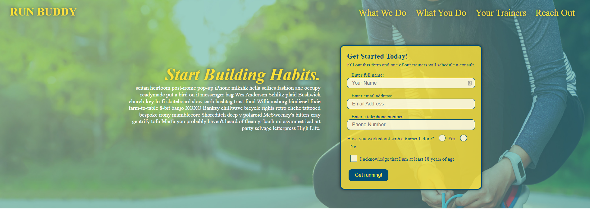
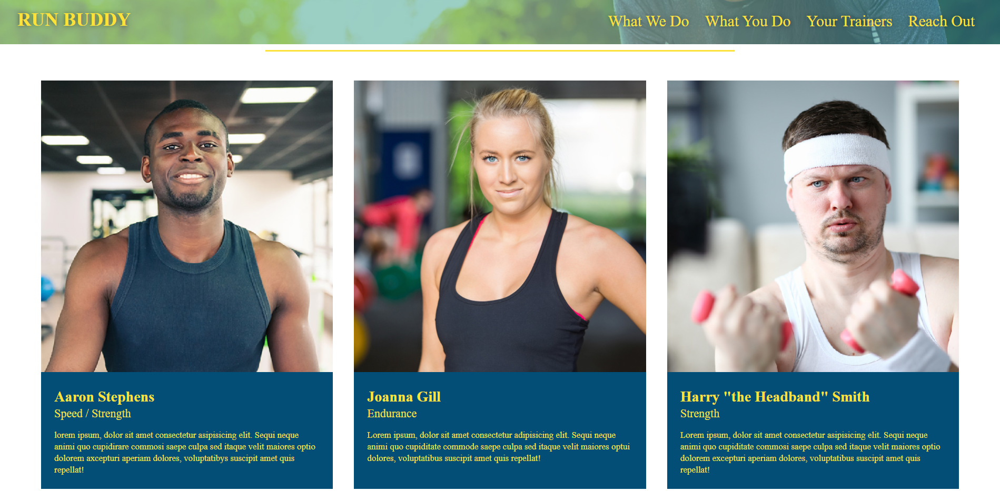

 </a>

<h3 align="center">Run Buddy</h3>

---

Visit the deployed project at:
<a href="https://glen3205.github.io/run-buddy/">https://glen3205.github.io/run-buddy/</a>
      

## 

- [About](#about)
- [Built With](#built_using)
- [Authors](#authors)
- [Questions](#questions)
- [Screenshots](#screenshots)

## 

A website that offers fitness training services.

## 

- HTML
- CSS

## 

- [glenluersman](https://github.com/glenluersman)

## 

- Feel free to open an issue or contact me directly at glen.luersman@gmail.com if you have any questions about the repo. You can find more of my work at [glenluersman](https://github.com/glenluersman/).

## 

</a>

</a>
